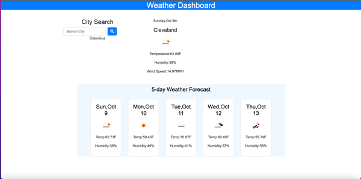

# Weather Dashboard App

  A web application that allows users to search for a city to get current weather and a 5 day forecast. Local storage will allow the user to see previous loactions searched. 

## Usage
Type in location and see the 5 day forecast for the area and see previous locations searched. 

 <a href="https://emmcewen.github.io/Weather_Dashboard/">Click for live link</a>

## Credits

GitHub: https://github.com/emmcewen/Weather_Dashboard

## License
MIT License

Copyright (c) [2022] [Emily McEwen

Permission is hereby granted, free of charge, to any person obtaining a copy
of this software and associated documentation files (the "Software"), to deal
in the Software without restriction, including without limitation the rights
to use, copy, modify, merge, publish, distribute, sublicense, and/or sell
copies of the Software, and to permit persons to whom the Software is
furnished to do so, subject to the following conditions:

The above copyright notice and this permission notice shall be included in all
copies or substantial portions of the Software.

THE SOFTWARE IS PROVIDED "AS IS", WITHOUT WARRANTY OF ANY KIND, EXPRESS OR
IMPLIED, INCLUDING BUT NOT LIMITED TO THE WARRANTIES OF MERCHANTABILITY,
FITNESS FOR A PARTICULAR PURPOSE AND NONINFRINGEMENT. IN NO EVENT SHALL THE
AUTHORS OR COPYRIGHT HOLDERS BE LIABLE FOR ANY CLAIM, DAMAGES OR OTHER
LIABILITY, WHETHER IN AN ACTION OF CONTRACT, TORT OR OTHERWISE, ARISING FROM,
OUT OF OR IN CONNECTION WITH THE SOFTWARE OR THE USE OR OTHER DEALINGS IN THE

SOFTWARE.

## Badges

 
 
 

  ## Features

  HTML, Javascript, Ajax, Jquery, Restful API
  
  

  
  